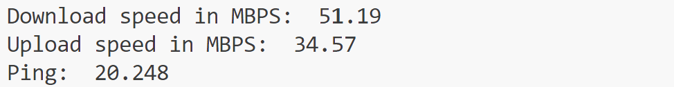

🌐 Internet Speed Test using Python 🐍 🌐
---------------------------------------

---------------------------------------
A short Python program that checks your internet performance—download speed, upload speed, and latency (ping)—with the speedtest module.

🚀 Features
-------------
*Measures Download speed in Mbps
*Measures Upload speed in Mbps
*Shows Ping in milliseconds

🛠 Requirements
------------------
* Python 3.x
* speedtest module

Install the required module:

pip install speedtest-cli
-------------------------

